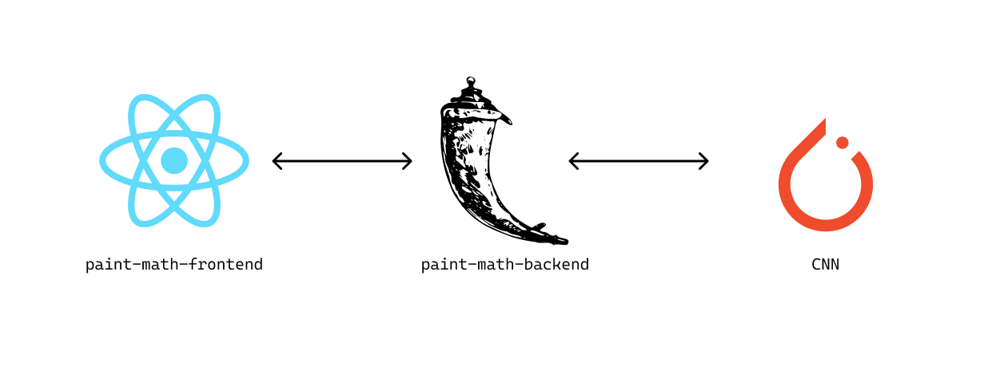

# PaintMath [open app ↗️](https://paintmath.herokuapp.com/)

## Description
PaintMath is an application for calculating simple 
handwritten mathematical expressions.

App is based around a neural network for 
handwritten number classification. The model was 
developed using *PyTorch*.
Applications' front end was developed with *ReactJS*. 
It communicates with a back end endpoint for classification developed with *Flask*.

## Install and run project

### Front end
Before running the app you should install all the needed dependencies:

### `npm install`

Then you can run:

### `npm start`

Runs the front end app.\
Open [http://localhost:3000](http://localhost:3000) to view it in your browser.

### Back end
In the back end project directory, you can run:

### `flask run`
Starts the server in [http://localhost:5000](http://localhost:5000)

## Using PaintMath
Write a mathematical expression using addition, 
subtraction, multiplication and division. Keep operands spaced 
out.
Once finished, press the 'calculate' button to get the result.
To see the exact bounding boxes press the 'Toggle 
bounding boxes' button. 

For additional instructions press the Help button.

## Author

* Lucija Aleksić
